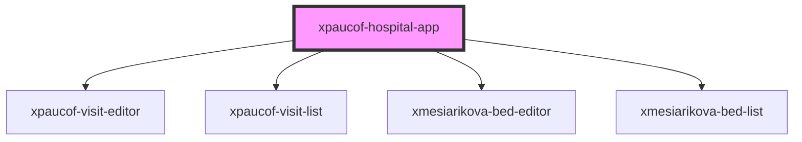

# xpaucof-hospital-app

<!-- Auto Generated Below -->

## Properties

| Property       | Attribute        | Description | Type     | Default     |
| -------------- | ---------------- | ----------- | -------- | ----------- |
| `bedApiBase`   | `bed-api-base`   |             | `string` | `undefined` |
| `visitApiBase` | `visit-api-base` |             | `string` | `undefined` |
| `wardId`       | `ward-id`        |             | `string` | `undefined` |

## Dependencies

### Depends on

- [xpaucof-visit-editor](../xpaucof-visit-editor)
- [xpaucof-visit-list](../xpaucof-visit-list)
- [xmesiarikova-bed-editor](../xmesiarikova-bed-editor)
- [xmesiarikova-bed-list](../xmesiarikova-bed-list)

### Graph

----------------------------------------------

*Built with [StencilJS](https://stenciljs.com/)*
