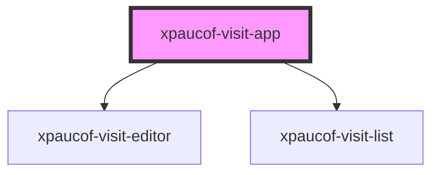

# xpaucof-visit-app

<!-- Auto Generated Below -->

## Properties

| Property   | Attribute   | Description | Type     | Default     |
| ---------- | ----------- | ----------- | -------- | ----------- |
| `apiBase`  | `api-base`  |             | `string` | `undefined` |
| `basePath` | `base-path` |             | `string` | `""`        |
| `wardId`   | `ward-id`   |             | `string` | `undefined` |

## Dependencies

### Depends on

- [xpaucof-visit-editor](../xpaucof-visit-editor)
- [xpaucof-visit-list](../xpaucof-visit-list)

### Graph

----------------------------------------------

*Built with [StencilJS](https://stenciljs.com/)*
